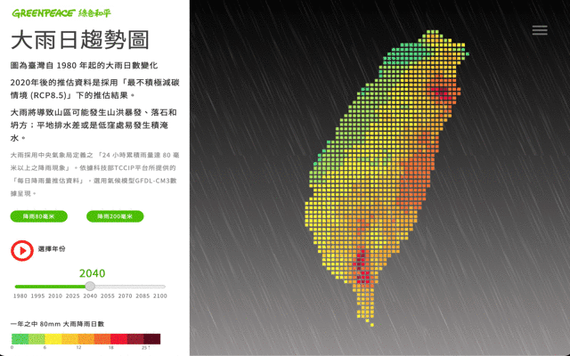

# Taiwan Climate Change Rainfall Risk Dashboard

An interactive web dashboard visualizing Taiwan's future rainfall patterns and extreme weather risks under climate change scenarios.

## 🌧️ Project Overview

This Shiny dashboard presents Taiwan's rainfall trend projections from 1980 to 2100, focusing on heavy rain (80mm+) and torrential rain (200mm+) patterns. The visualization helps users understand how climate change may affect extreme rainfall events across Taiwan under the RCP8.5 scenario (least aggressive carbon reduction pathway).

## 🎯 Features

- **Interactive Timeline**: Explore rainfall patterns from 1980 to 2100 with 5-year intervals
- **Dual Rain Intensity Views**: 
  - Heavy rain (80mm+ in 24 hours)
  - Torrential rain (200mm+ in 24 hours)
- **Responsive Design**: Optimized for both desktop and mobile devices
- **Real-time Animation**: Play through timeline to see rainfall pattern evolution
- **Regional Coverage**: Focuses on Taiwan's major metropolitan areas

## 🔧 Technology Stack

- **Backend**: R, Shiny Framework
- **Frontend**: HTML, CSS, JavaScript
- **Data Source**: Taiwan Climate Change Projection Information and Adaptation Knowledge Platform (TCCIP)
- **Climate Model**: GFDL-CM3
- **Deployment**: Shinyapps.io

## 📊 Data Sources

- **TCCIP Platform**: Taiwan's official climate projection data
- **Central Weather Bureau**: Rainfall classification standards
- **National Science and Technology Center for Disaster Reduction**: Climate data processing

## 🚀 Demo

🔗 **Live Demo**: [Taiwan Rainfall Risk Dashboard](https://miaochien.shinyapps.io/ccdashboard-rain/)

## 📱 Screenshots

### Desktop View


### Rainfall Risk Maps
- Heavy Rain (80mm+) projections
- Torrential Rain (200mm+) projections

## 🛠️ Installation & Setup

### Prerequisites
- R (version 4.0+)
- RStudio (recommended)

### Required R Packages
```r
install.packages(c(
  "shiny",
  "shinycssloaders", 
  "shinyWidgets",
  "magrittr",
  "dplyr",
  "tidyr"
))
```

### Running Locally
1. Clone this repository:
```bash
git clone https://github.com/MiaoChien0204/taiwan-climate-rainfall-dashboard.git
cd taiwan-climate-rainfall-dashboard
```

2. Open R/RStudio and set working directory to the project folder

3. Run the application:
```r
shiny::runApp()
```

4. Access the dashboard at `http://localhost:3838`

## 📁 Project Structure

```
├── ui.R                    # User interface definition
├── server.R                # Server logic and reactivity
├── global.R                # Global variables and functions
├── www/                    # Static web assets
│   ├── custom555.css       # Custom styling
│   └── img/                # Images and rainfall maps
│       ├── Taiwan_80mm/    # Heavy rain projection maps
│       ├── Taiwan_200mm/   # Torrential rain projection maps
│       └── legend_*.png    # Map legends
└── rsconnect/              # Deployment configuration
```

## 🎨 Key Components

### Data Visualization
- **Temporal Analysis**: 120+ years of rainfall data (1980-2100)
- **Spatial Mapping**: Geographic visualization of rainfall intensity
- **Risk Assessment**: Color-coded risk levels for different regions

### User Interface
- **Intuitive Controls**: Simple slider and button navigation
- **Responsive Layout**: Adapts to different screen sizes
- **Accessibility**: Clear labeling and navigation structure

## 🌡️ Climate Scenarios

This dashboard uses the **RCP8.5 scenario**, representing:
- Highest greenhouse gas concentration trajectory
- "Business as usual" carbon emission patterns
- Most conservative climate action assumptions

## ⚠️ Impact Assessment

### Heavy Rain (80mm+) Risks:
- Mountain flash floods
- Landslides and rockfalls
- Urban flooding in low-lying areas

### Torrential Rain (200mm+) Risks:
- Severe mountain torrents
- Major landslides and debris flows
- Widespread urban flooding

## 🤝 Contributing

Contributions are welcome! Please feel free to submit issues and enhancement requests.

## 📄 License

This project is open source and available under the [MIT License](LICENSE).

## 🙏 Acknowledgments

- Taiwan Climate Change Projection Information and Adaptation Knowledge Platform (TCCIP)
- National Science and Technology Center for Disaster Reduction
- Central Weather Bureau of Taiwan
- Greenpeace East Asia, Taiwan Office (Original campaign context)

---

*This dashboard was developed to raise awareness about climate change impacts on Taiwan's extreme weather patterns and support evidence-based climate adaptation planning.*
